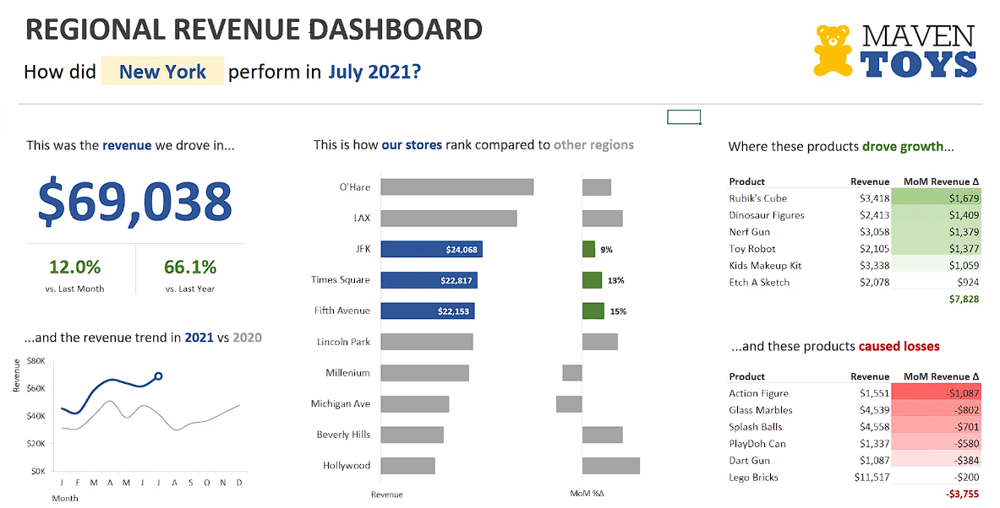

#  Maven Toys: Regional Revenue & Performance Tracker

## 📌 Project Overview

As the **Lead BI Analyst** for Maven Toys, I was tasked with solving a major operational pain point: **inconsistent reporting**.

The COO and Regional Sales Managers required a **single source of truth** to unify the chain’s performance view across the United States.

---

## 🎯 Business Needs & "The Pain Point"

Before this dashboard:

* Data was siloed and inconsistently presented across regions.

Key requirements:

* **Standardization:** Unified layout for all Regional Managers.
* **YoY Analysis:** Track monthly revenue trends vs. previous year.
* **Operational Focus:** Identify stores/products driving gains or losses.
* **Scalability:** Workbook designed for easy monthly refresh with new data (~4,300+ records).

---

## 🏗️ Technical Implementation (Excel Architecture)

I built this solution using **advanced Excel logic** to emulate high-end BI tools:

* **Data Preparation:** Cleaned and standardized ~4,300 records (Jan 2020 – July 2021).
* **Advanced Logic:**

  * **Top N Formulas:** Dynamically identify best/worst-performing products.
  * **Previous Period Calculations:** Custom formulas for YoY and MoM variances.
  * **Automatic Sorting:** Rankings update instantly with filters.
* **UI/UX Design:** Conditional Formatting for performance alerts; Form Controls for intuitive regional filtering.

---

## 💡 Business Impact

* **Efficiency:** Eliminated manual report consolidation, saving hours of prep time.
* **Clarity:** Immediate visibility into top/bottom performers, enabling faster managerial interventions.
* **Standardization:** Scalable reporting template ready for future fiscal years.

---

## 🛠️ Tech Stack & Concepts

* **Tool:** Microsoft Excel
* **Key Concepts:** Top N Analysis, YoY/MoM Growth, Dynamic Sorting, Slicers, Data Validation

---

## 🚀 How to Use

1. Download the file: `MavenToys_Regional_Tracker.xlsx`
2. Open in **Microsoft Excel Desktop**.
3. Use the filters and slicers to explore **store- and product-level performance**.
